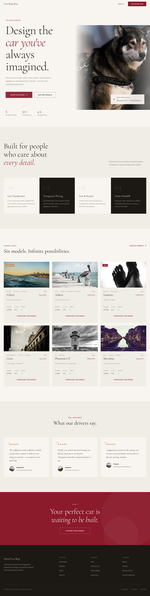
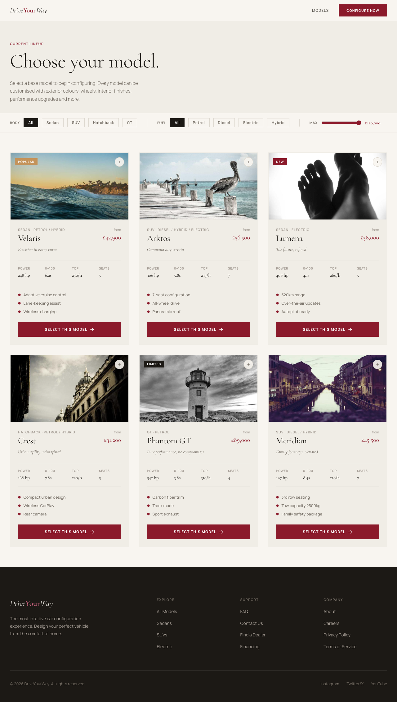

# DriveYourWay - Interactive Car Configurator

An immersive, user-centric car configurator built with React and TypeScript that allows customers to customize and visualize their ideal car in real-time.

## Features

- **Multi-page progressive disclosure** - Step-by-step configuration flow
- **Real-time 3D visualization** - Interactive car preview with instant updates
- **Mobile-first responsive design** - Optimized for all devices
- **Dynamic pricing** - Live price calculations as you configure
- **Complete configuration persistence** - Save and return to your build
- **Seamless navigation** - Smooth transitions between pages

## Screenshots


*Landing page with featured car models*


*Browse and filter available car models*


*Real-time customization with 3D preview*

## Tech Stack

- **Frontend:** React 18, TypeScript, React Router v6
- **Build Tool:** Vite
- **3D Rendering:** SVG-based car visualization
- **State Management:** React Context API
- **Styling:** Native CSS with modern features

## Getting Started

### Prerequisites

- Node.js (v18 or higher)
- npm or yarn

### Installation

```bash
npm install
```

### Development

```bash
npm run dev
```

Open your browser to `http://localhost:5173` to see the application.

### Build

```bash
npm run build
```

### Preview Production Build

```bash
npm run preview
```

## Project Structure

```
src/
├── components/          # Reusable UI components
│   ├── CarVisualization.tsx  # 3D car renderer
│   ├── Footer.tsx
│   ├── Navbar.tsx
│   └── ProgressBar.tsx
├── context/             # State management
│   └── ConfiguratorContext.tsx
├── data/                # Static data
│   ├── models.ts        # Car model definitions
│   └── options.ts       # Configuration options
├── pages/               # Route pages
│   ├── Checkout.tsx
│   ├── Configurator.tsx # Main configuration hub
│   ├── Home.tsx
│   ├── ModelSelection.tsx
│   ├── Summary.tsx
│   └── ThankYou.tsx
├── App.tsx              # Main app component with routing
├── index.css            # Global styles
└── main.tsx             # Entry point
```

## User Flow

1. **Home** - Landing page with featured models
2. **Model Selection** - Choose your base vehicle
3. **Configurator** - Customize exterior, interior, performance, and accessories
4. **Summary** - Review your configuration and pricing
5. **Checkout** - Complete purchase or reserve at dealer
6. **Thank You** - Order confirmation and next steps

## Configuration Options

- **Exterior:** Colors, wheel designs, roof types, accessories
- **Interior:** Materials, color schemes, seat configurations, tech packages
- **Performance:** Engine options, transmission, suspension, driving modes
- **Accessories:** Safety, comfort, and lifestyle additions

## Features in Development

- [ ] AR/VR preview integration
- User accounts with save-and-return functionality
- Advanced 3D rendering with Three.js
- Dealer integration API
- Financing calculator
- Social sharing capabilities

## Contributing

This is a private project. For internal development, follow these guidelines:

1. Use TypeScript strict mode
2. Follow existing component patterns
3. Ensure responsive design
4. Test on multiple viewport sizes

## License

Private - All rights reserved

## Support

For issues or feature requests, contact the development team.